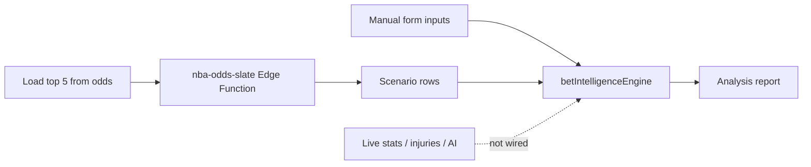

# CourtLedger

CourtLedger is a full-stack **NBA betting tracker and analytics dashboard**. It helps you log props and game bets, track active positions, grade outcomes, visualize ROI, export your ledger, and explore optional tooling around props analysis and highlights.

**Live app:** [https://court-ledger.vercel.app](https://court-ledger.vercel.app)

---

## Table of contents

1. [What this project is](#what-this-project-is)
2. [Architecture overview](#architecture-overview)
3. [App routes and features](#app-routes-and-features)
4. [Tech stack](#tech-stack)
5. [Repository layout](#repository-layout)
6. [Local development](#local-development)
7. [Environment variables](#environment-variables)
8. [Supabase setup](#supabase-setup)
9. [Vercel deployment](#vercel-deployment)
10. [Serverless API routes](#serverless-api-routes)
11. [Supabase Edge Functions](#supabase-edge-functions)
12. [Keep-alive system](#keep-alive-system)
13. [Bet Intelligence — how it works and why it often fails](#bet-intelligence--how-it-works-and-why-it-often-fails)
14. [Highlight Hub](#highlight-hub)
15. [Scripts](#scripts)
16. [Security notes](#security-notes)

---

## What this project is

CourtLedger is **not** a sportsbook. It is a personal command center for:

- Recording bets (player props, spreads, totals, etc.)
- Tracking pending vs settled results and P/L
- Filtering, sorting, duplicating, and quick-grading bets
- Analytics charts (profit over time, by market, by book)
- CSV / XLSX export
- Optional auto-settlement for supported NBA player props via balldontlie
- Optional structured prop analysis (Bet Intelligence)
- Embedded official NBA YouTube highlights (Highlight Hub)

Authentication is handled by **Supabase Auth**. All bet data is scoped per user with **Row Level Security (RLS)**.

---

## Architecture overview

```mermaid
flowchart TB
  subgraph browser [Browser - React SPA]
    Pages[Pages and Components]
    ClientSupabase[Supabase Client - anon key]
    Pages --> ClientSupabase
  end

  subgraph vercel [Vercel]
    Static[Static Vite build - dist]
    ApiKeepalive[/api/keepalive]
    ApiHighlights[/api/youtube-highlights]
  end

  subgraph supabase [Supabase]
    Auth[Auth]
    DB[(PostgreSQL)]
    EdgeOdds[nba-odds-slate]
    EdgeSettle[sync-bet-settlements]
  end

  subgraph external [External APIs]
    YouTube[YouTube Data API]
    OddsAPI[The Odds API]
    BDL[balldontlie]
  end

  Pages --> Static
  Pages --> ApiHighlights
  ClientSupabase --> Auth
  ClientSupabase --> DB
  ClientSupabase --> EdgeOdds
  ApiKeepalive --> DB
  ApiHighlights --> YouTube
  EdgeOdds --> OddsAPI
  EdgeOdds --> BDL
  EdgeSettle --> BDL
  EdgeSettle --> DB
```

| Layer | Role |
|-------|------|
| **React + Vite** | Single-page app, client routing, UI |
| **Supabase client** | Auth, CRUD on `bets`, intelligence report history |
| **Vercel serverless** | Server-only secrets (YouTube, Supabase service role for keepalive) |
| **Supabase Edge Functions** | Odds slate fetch, auto-settlement cron target |
| **GitHub Actions** | Weekly ping to keep Vercel + Supabase warm |

---

## App routes and features

| Route | Page | Purpose |
|-------|------|---------|
| `/` | Command Center | Add/edit bets, active & settled lists, filters, export, stream panel for individual bets |
| `/history` | Bet History | Full ledger with edit/grade/duplicate |
| `/live` | Highlight Hub | Embedded recent official NBA YouTube highlights |
| `/markets` | Market Intelligence | Market-level views from your bet data |
| `/analytics` | ROI Analytics | Charts and performance metrics |
| `/intelligence` | Bet Intelligence | Manual prop analysis + optional live odds slate |
| `/settings` | Settings | Account preferences |

**Core betting features**

- Supabase auth (sign up, log in, sign out, persistent session)
- User-scoped bet CRUD with column pruning for schema compatibility
- Active / settled sections, quick grade, duplicate
- Net P/L, ROI, win rate, average stake/odds
- Bet slip OCR helper (Tesseract.js)
- CSV and XLSX export
- Per-bet stream URL embed on Command Center (`StreamPanel`)
- Auto-settle for supported NBA player props (optional)

---

## Tech stack

- **Frontend:** React 19, TypeScript, Vite, React Router, Tailwind CSS
- **Backend / data:** Supabase (Auth, Postgres, Edge Functions)
- **Hosting:** Vercel (static SPA + serverless API routes)
- **Charts:** Recharts
- **Export:** SheetJS (`xlsx`)
- **Toasts:** react-hot-toast
- **OCR:** tesseract.js

---

## Repository layout

```
CourtLedger/
├── api/                          # Vercel serverless functions
│   ├── keepalive.ts              # Weekly Supabase ping
│   └── youtube-highlights.ts     # YouTube Data API proxy
├── lib/
│   └── supabaseAdmin.ts          # Server-only Supabase client (service role)
├── src/
│   ├── pages/                    # Route-level pages
│   ├── components/               # UI by domain (bets, auth, intelligence, …)
│   ├── hooks/                    # useCourtLedgerData, useIntelligenceReports
│   ├── lib/                      # Services (bets, auth, intelligence engine, …)
│   ├── types/                    # TypeScript models
│   └── utils/                    # Grading, export, filtering, etc.
├── supabase/
│   ├── functions/                # Edge Functions
│   └── migrations/               # SQL migrations
├── .github/workflows/
│   └── keepalive.yml             # Weekly cron → /api/keepalive
├── vercel.json                   # SPA rewrites + /api/* passthrough
└── README.md
```

---

## Local development

### Prerequisites

- Node.js 18+
- A Supabase project
- (Optional) Supabase CLI via `npx supabase`
- (Optional) Vercel CLI for testing API routes locally

### Steps

1. **Install dependencies**

   ```bash
   npm install
   ```

2. **Environment file**

   Create `.env.local` (or `.env`) at the project root:

   ```env
   VITE_SUPABASE_URL=https://YOUR_PROJECT_REF.supabase.co
   VITE_SUPABASE_ANON_KEY=your_anon_key
   ```

3. **Run the dev server**

   ```bash
   npm run dev
   ```

   Open the URL Vite prints (usually `http://localhost:5173`).

4. **Test Vercel API routes locally**

   The Vite dev server does **not** serve `/api/*`. Use:

   ```bash
   npx vercel dev
   ```

   Then hit `http://localhost:3000/api/keepalive` or `/api/youtube-highlights`.

### Supabase CLI (Windows-friendly)

The CLI is in `devDependencies`. From the project root:

```powershell
npx supabase login
npx supabase link --project-ref YOUR_PROJECT_REF
npx supabase db push
npx supabase secrets set THE_ODDS_API_KEY=your_key BALLDONTLIE_API_KEY=your_key
npx supabase functions deploy nba-odds-slate
npx supabase functions deploy sync-bet-settlements --no-verify-jwt
```

Or use npm scripts: `npm run sb:login`, `npm run sb:link`, `npm run sb:deploy:odds`, `npm run sb:deploy:settle`.

---

## Environment variables

### Client-side (Vite — exposed to the browser)

| Variable | Where used |
|----------|------------|
| `VITE_SUPABASE_URL` | `src/lib/supabase.ts` |
| `VITE_SUPABASE_ANON_KEY` | `src/lib/supabase.ts` |

These are baked into the build at deploy time. Changing them in Vercel requires a **redeploy**.

### Server-side (Vercel — never exposed to the browser)

| Variable | Where used |
|----------|------------|
| `SUPABASE_URL` | `lib/supabaseAdmin.ts` (keepalive) |
| `SUPABASE_SERVICE_ROLE_KEY` | `lib/supabaseAdmin.ts` (keepalive) |
| `YOUTUBE_DATA_API_KEY` | `api/youtube-highlights.ts` |
| `YOUTUBE_NBA_CHANNEL_ID` | Optional override for Highlight Hub channel |

**Do not** prefix server secrets with `VITE_`. Do not commit API keys to git.

---

## Supabase setup

### Expected tables

- `profiles` — user profile rows
- `bets` — main betting ledger
- `live_stats_cache` — reserved for future live data
- `bet_intelligence_reports` — saved intelligence reports (requires migration)

All tables should use RLS so users only access their own `user_id` rows.

### Migrations

Run in Supabase **SQL Editor** or via `supabase db push`:

| File | Purpose |
|------|---------|
| `supabase/migrations/20260330120000_bet_intelligence_reports.sql` | Intelligence report history |
| `supabase/migrations/20260330140000_bets_auto_settle.sql` | Auto-settle columns on `bets` |

The app uses **column pruning** on insert/update, so older schemas still load until you migrate.

### Auto-settle columns on `bets`

Adds: `auto_settle_enabled`, `stats_player_id`, `stats_game_id`, `last_auto_settle_at`, `auto_settle_error`.

Command Center bet form includes **Auto-settle** and optional stats API IDs. Grading logic is shared with `src/utils/propSettlement.ts` and the Edge Function — keep them aligned if you change rules.

---

## Vercel deployment

1. Push the repo to GitHub (or GitLab/Bitbucket).
2. Import the project in [Vercel](https://vercel.com).
3. Build settings (usually auto-detected):
   - **Build command:** `npm run build`
   - **Output directory:** `dist`
4. Set environment variables (Production + Preview as needed):
   - `VITE_SUPABASE_URL`
   - `VITE_SUPABASE_ANON_KEY`
   - `YOUTUBE_DATA_API_KEY`
   - `SUPABASE_URL`
   - `SUPABASE_SERVICE_ROLE_KEY`
5. Deploy.

`vercel.json` rewrites all non-API paths to `index.html` for client-side routing, while `/api/*` hits serverless functions.

### Post-deploy checklist

- [ ] Sign up / log in works
- [ ] Create, edit, delete bets under RLS
- [ ] Charts render with real data
- [ ] CSV / XLSX export downloads
- [ ] Highlight Hub loads (after `YOUTUBE_DATA_API_KEY` is set)
- [ ] Keepalive workflow runs (see below)

---

## Serverless API routes

### `GET /api/keepalive`

- **File:** `api/keepalive.ts`
- **Purpose:** Lightweight Supabase query (`select id from bets limit 1`) to keep the database connection path warm
- **Auth:** None (public ping; returns no sensitive row data)
- **Env:** `SUPABASE_URL`, `SUPABASE_SERVICE_ROLE_KEY`

### `GET /api/youtube-highlights`

- **File:** `api/youtube-highlights.ts`
- **Purpose:** Fetch recent highlight videos from the official @NBA YouTube channel
- **Auth:** None for read; API key stays server-side
- **Env:** `YOUTUBE_DATA_API_KEY`, optional `YOUTUBE_NBA_CHANNEL_ID`

---

## Supabase Edge Functions

### `nba-odds-slate`

Powers **Bet Intelligence → Load top 5 from odds**.

- One Odds API request (player points/rebounds/assists, US region)
- Ranks lines by devigged implied probability
- Returns up to 5 scenarios for the Top Picks scanner

**Secrets:** `THE_ODDS_API_KEY`, `BALLDONTLIE_API_KEY`

```bash
npx supabase functions deploy nba-odds-slate
```

Requires a signed-in user (JWT). See [Bet Intelligence troubleshooting](#bet-intelligence--how-it-works-and-why-it-often-fails).

### `sync-bet-settlements`

Auto-grades pending bets with `auto_settle_enabled` using balldontlie box scores.

**Secrets:** `BALLDONTLIE_API_KEY`, optional `CRON_SECRET`

```bash
npx supabase functions deploy sync-bet-settlements --no-verify-jwt
```

Invoke on a schedule (GitHub Actions, pg_cron, etc.) during game windows. Moneyline, spread, and game totals are **not** auto-graded.

---

## Keep-alive system

Inactive free-tier projects can pause. CourtLedger includes a weekly ping:

1. **GitHub Actions** — `.github/workflows/keepalive.yml`
   - Cron: Mondays 09:00 UTC
   - Manual trigger: `workflow_dispatch`
   - Calls your deployed endpoint with `curl --fail`

2. **Vercel endpoint** — `/api/keepalive` runs a minimal Supabase query.

**Before enabling:** Edit `.github/workflows/keepalive.yml` and replace `YOUR-APP-NAME` with your real Vercel hostname (e.g. `court-ledger`).

Set `SUPABASE_URL` and `SUPABASE_SERVICE_ROLE_KEY` in Vercel for the keepalive function.

---

## Bet Intelligence — how it works and why it often fails

This section is important: **Bet Intelligence is not powered by AI.** There is no OpenAI, no LLM, and no machine-learning model in this codebase. The name refers to a **structured, rule-based analysis engine** that runs entirely in the browser.

### What Bet Intelligence actually is

| Piece | Location | What it does |
|-------|----------|--------------|
| Manual scenario form | `BetIntelligencePanel` | You enter player, line, odds, notes |
| Analysis engine | `src/lib/betIntelligenceEngine.ts` | Deterministic projection, edge score, trap detection, simulation bands |
| Sub-engines | `projectionEngine`, `lineMovement`, `edgeScoring`, `simulationEngine`, `riskAssessment` | Heuristics over your **manual** inputs |
| Report UI | `AnalysisResultCard` | Structured verdict (Bet / Lean / Pass) |
| Top Picks scanner | `TopPicksToday` | Runs the same engine over multiple scenarios |
| Live odds loader | `nbaOddsSlateService` → Edge Function `nba-odds-slate` | Optional: pull real board lines from The Odds API |
| Report persistence | `bet_intelligence_reports` table | Save/load analysis history |
| Data provider stub | `intelligenceDataProvider.ts` | **Not implemented** — no live injuries, stats, or lineups feed |



### What works today

| Feature | Status | Notes |
|---------|--------|-------|
| **Analyze Bet** (manual form) | Works offline | Fill player, team, line, odds, optional notes → click Analyze |
| **Load samples** | Works | Demo scenarios in `sampleBetIntelligence.ts` |
| **Save report** | Works if migrated | Requires `bet_intelligence_reports` migration |
| **Add to tracker** | Works | Creates a pending bet from analysis or top pick |
| **Report history** | Works if migrated | Loads from Supabase per user |

### What is broken or unreliable

| Feature | Typical failure | Root cause |
|---------|-----------------|------------|
| **Load top 5 from odds** | `Could not reach Supabase Edge Functions` | Browser never gets a response — ad blocker, VPN, corporate firewall, or wrong `VITE_SUPABASE_URL` |
| **Load top 5 from odds** | `HTTP 401 Invalid JWT` | Production env mismatch: `VITE_SUPABASE_ANON_KEY` / URL not from the same Supabase project where `nba-odds-slate` is deployed; stale session in `localStorage` |
| **Load top 5 from odds** | `HTTP 404` | Edge Function not deployed, or frontend points at a different Supabase project ref |
| **Load top 5 from odds** | `HTTP 500` / `502` | Missing Edge Function secrets (`THE_ODDS_API_KEY`, `BALLDONTLIE_API_KEY`) or Odds API quota exhausted |
| **Load top 5 from odds** | Empty results | Off-season, no US player prop markets listed, or books not returning P/R/A markets |
| **Top Picks list empty** | "No picks cleared the quality bar" | Engine filters aggressively (edge ≥ 6, no trap flag, verdict Bet/Lean). Thin or sample data often fails the bar — **this is by design**, not a crash |
| **Expecting "AI picks"** | Disappointing / "doesn't work" | **There is no AI.** Outputs are conservative heuristics from manual text fields, not predictive models |
| **Live injury / stats context** | Always generic reasons | `intelligenceDataProvider` is a no-op stub; no API enriches scenarios automatically |

### Why people think "the AI doesn't work"

1. **Naming mismatch** — The UI says "Intelligence" but the system is rule-based math + text heuristics, not generative AI or ML.
2. **Live odds path is fragile** — It depends on Supabase Edge Functions, JWT auth, third-party API keys, and browser network access to `*.supabase.co`. Any link in that chain breaks the button.
3. **Production env drift** — Vite embeds Supabase URL/key at build time. If Vercel Production is missing `VITE_SUPABASE_ANON_KEY` or uses a key from a different project, every Edge Function invoke returns 401 even when local dev works.
4. **Gateway JWT vs in-function auth** — Supabase's Edge Function gateway validates JWTs before your code runs. Misaligned keys or expired sessions surface as `Invalid JWT` before the function logic executes.
5. **No live data pipeline** — Without injuries, minutes, pace, and form APIs wired in, projections default to conservative baselines; reports look generic or always "Pass."
6. **Strict pick filtering** — Even when odds load successfully, the Top Picks scanner may show zero cards because scenarios fail quality thresholds.

### Workarounds that work right now

1. Use **Analyze Bet** with manual inputs (player, line, opening line, recent form text, injury notes).
2. Click **Load samples** instead of **Load top 5 from odds** to populate the slate scanner offline.
3. If odds load fails, the app falls back to sample scenarios automatically (see `TopPicksToday.tsx`).
4. For live odds, verify the full chain:
   - Same Supabase project ref in `.env`, Vercel Production, and Edge Function deploy target
   - `nba-odds-slate` deployed with secrets set
   - Sign out, clear site data, sign in again
   - Disable ad blockers for your app domain and `*.supabase.co`
   - Check **Supabase → Edge Functions → nba-odds-slate → Logs**

### Bet Intelligence code map

```
src/types/betIntelligence.ts          Types
src/lib/betIntelligenceEngine.ts      Main engine (NOT AI)
src/lib/projectionEngine.ts           Projection heuristics
src/lib/lineMovement.ts               Opening vs current line
src/lib/edgeScoring.ts                Edge score + calibrated probability
src/lib/simulationEngine.ts           Variance bands (not Monte Carlo live sim)
src/lib/riskAssessment.ts             Risk flags
src/lib/betIntelligenceService.ts     Supabase report CRUD
src/lib/nbaOddsSlateService.ts        Edge Function client + error mapping
src/hooks/useIntelligenceReports.ts   Report history hook
src/components/intelligence/*         UI
src/pages/BetIntelligencePage.tsx     Page shell
src/data/sampleBetIntelligence.ts     Offline demo scenarios
supabase/functions/nba-odds-slate/    Live odds Edge Function
```

### Production 401 checklist (Vercel + Supabase)

1. Vercel **Production** env:
   - `VITE_SUPABASE_URL` = `https://YOUR_PROJECT_REF.supabase.co`
   - `VITE_SUPABASE_ANON_KEY` = anon key from **that same project**
2. Redeploy after any env change (old builds keep old values).
3. Clear browser site data / `localStorage` keys starting with `sb-`, then sign in again.
4. Confirm `nba-odds-slate` is deployed in the same Supabase project as the URL ref.
5. Confirm Edge Function secrets: `THE_ODDS_API_KEY`, `BALLDONTLIE_API_KEY`.

---

## Highlight Hub

**Route:** `/live` (sidebar: **Highlight Hub**)

Embeds recent highlight uploads from the official @NBA YouTube channel (`UCWJ2lWNubArHWmf3FIHbfcQ` by default).

- **Client:** `src/pages/LiveCenterPage.tsx`, `src/lib/youtubeHighlightsService.ts`
- **Server:** `api/youtube-highlights.ts`
- **Env:** `YOUTUBE_DATA_API_KEY` in Vercel (server-side only)

The YouTube API key must never be committed or exposed via `VITE_*` variables.

---

## Scripts

| Command | Description |
|---------|-------------|
| `npm run dev` | Vite dev server |
| `npm run build` | Typecheck + production build → `dist/` |
| `npm run preview` | Preview production build locally |
| `npm run lint` | ESLint |
| `npm run sb:login` | Supabase CLI login |
| `npm run sb:link` | Link local repo to Supabase project |
| `npm run sb:deploy:odds` | Deploy `nba-odds-slate` |
| `npm run sb:deploy:settle` | Deploy `sync-bet-settlements` |

---

## Security notes

- **Never commit** `.env`, service role keys, or third-party API keys.
- **Rotate keys** immediately if they are pasted in chat, logged, or checked into git.
- **Service role key** is only for server routes (`keepalive`) — never import it in `src/`.
- **Anon key** is safe for the browser but must pair with RLS policies on every table.
- **Edge Function secrets** (`THE_ODDS_API_KEY`, `BALLDONTLIE_API_KEY`) live in Supabase Dashboard only.

---

## License

Private project — see repository owner for usage terms.
